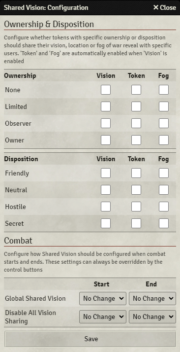

# Module Settings
{align=right width=33%}
In the Shared Vision module settings, you can find 2 buttons. The first button directs to thi documentation, while the second opens the module configuration.

## Ownership
Here you can configure the different [sharing option](sharingOptions.md) depending on the ownership level of tokens. These settings apply to all tokens, regardless of what has been configured in the actor's [vision config](visionConfig.md) or the token's [disposition](#disposition).

For example, checking 'Vision' for 'Observer' will allow a user to see the vision of all tokens on the canvas that the user has observer ownership for.

## Disposition
Here you can configure the different [sharing option](sharingOptions.md) depending on the disposition of tokens. These settings apply to all tokens, regardless of what has been configured in the actor's [vision config](visionConfig.md) or the token's [disposition](#disposition).

For example, checking 'Vision' for 'Friendly' will allow a user to see the vision of all friendly tokens on the canvas.

Players do not need to have any permissions in order for the tokens to share their view, token location or fog exploration. This will also work if the token is an NPC.

## Combat
In the 'Combat' section, you can configure ['Global Shared Vision'](controlButtons.md#global-shared-vision) or ['Disable All Vision Sharing'](controlButtons.md#disable-all-vision-sharing) to be enabled or disabled when combat starts or stops. 
This will activate or deactivate the corresponding control buttons.
<ul>
    <li><b>Enable Global Shared Vision</b>: Shares the vision for actors with enabled 'Global Shared Vision' in the actor's 'Permission Configuration' screen</li>
    <li><b>Disable All Vision Sharing</b>: Disables all vision/token/fog sharing</li>
</ul>