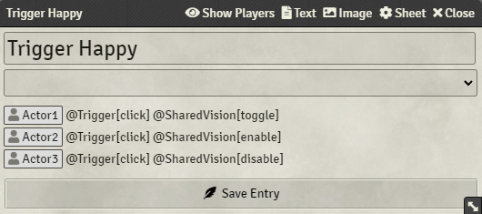
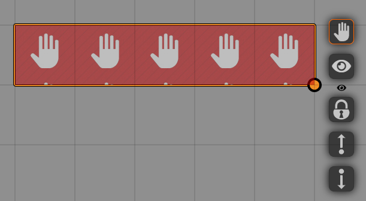

Some Shared Vision settings can be controlled from other modules or through hooks.

## Trigger Happy
{align=right width=50%}
'Global Shared Vision' can be enabled through [Trigger Happy](https://foundryvtt.com/packages/trigger-happy/) triggers, for example when a token moves onto another token, or when it is clicked. 
You set this up like you would any other trigger, and you add `@SharedVision[toggle]`, `@SharedVision[enable]` or `@SharedVision[disable]` trigger to toggle, enable or disable 'Global Shared Vision', respectively.

<b>Example:</b> 
To enable 'Global Shared Vision' when a token moves unto another token called 'test', you use: 
`@Token[test] @Trigger[move] @SharedVision[enable]` 
 
For more info on how to use Trigger Happy, please read the [documentation](https://github.com/League-of-Foundry-Developers/fvtt-module-trigger-happy/blob/master/README.md).
        
 

## Hey, Wait!
{align=right width=50%}
[Hey Wait!](https://foundryvtt.com/packages/hey-wait/) allows you to place a tile on the scene, and when a token moves onto that tile, the game pauses and the scene shifts to the player's token. 
You can set Shared Vision up to enable 'Global Shared Vision' when Hey, Wait! is triggered.

Follow the [Hey, Wait! documentation](https://github.com/1000nettles/hey-wait/blob/main/README.md) to create a 'Hey, Wait! tile'. 
Selecting and then right-clicking this tile will open the HUD which will show the eye icon. Pressing this icon will enable Global Shared Vision on the Hey, Wait! trigger.

 

## Triggering using Hooks
If you want to enable or disable 'Global Shared Vision' or 'Disable All Vision Sharing' using macros or a different module, you can call the following hook: 
<pre>
    Hooks.call("setSharedVision",{
        globalSharedVision: [true/false/'toggle'],
        disableAll: [true/false/'toggle']
    })
</pre>
Where you have to select either 'true', 'false' or '"toggle"' (note the quotation marks around 'toggle')