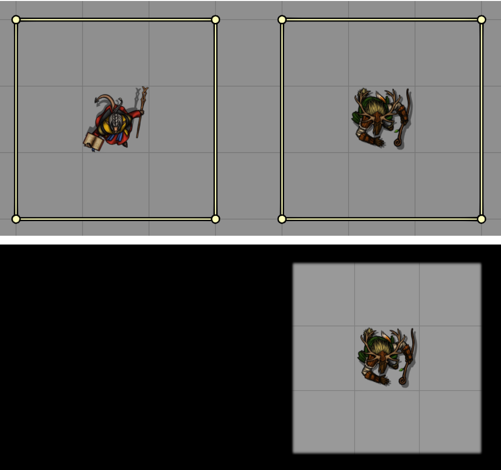
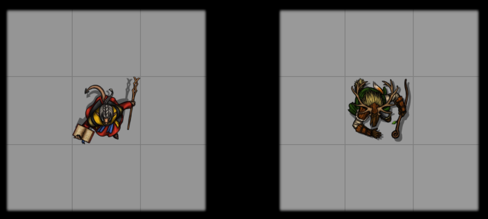
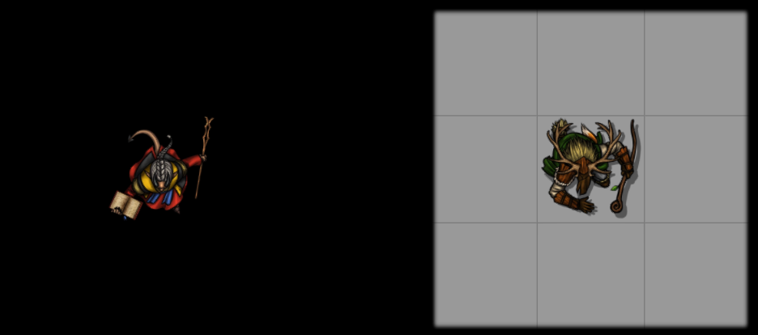
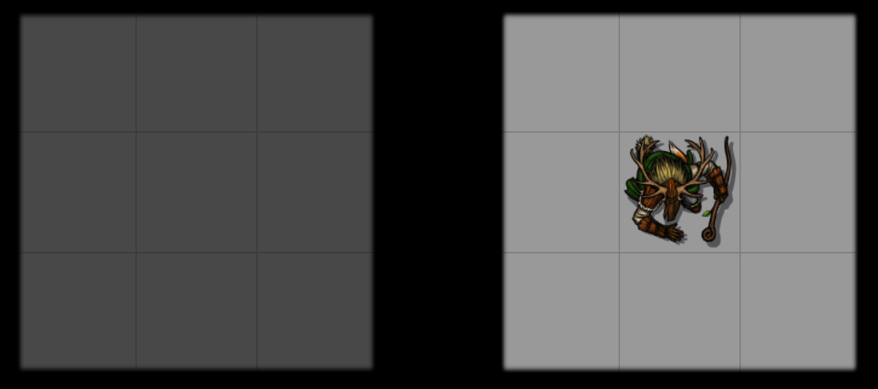

{align=right width=50%}
Shared vision allows for the sharing of 3 different things which can be enabled and disabled individually. 

They can be enabled for each player individually on an actor-by-actor basis (in the [vision config](visionConfig.md)), or for all players on the basis of token disposition or ownership status (in the [module settings](moduleSettings.md)).

For illustration purposes, take the two tokens in the image below which are in separate areas. If the right token is owned by the player, while the left token isn't, the player can only see the area on the right

 

## Vision
{align=right width=50%}
The 'Vision' option will share all vision of a token. With it enabled, vision is shared as if the token is owned and controlled by the player. 

Selecting or deselecting the token will not stop it sharing its vision. The token will only stop sharing its vision if the token becomes invisible, unless configured otherwise.

If fog of war exploration is enabled for the scene, the fog of war will also be updated.

 

## Token
{align=right width=50%}
The 'Token' option will share the location of a token, even if the token is hidden behind a wall or in an unexplored area of the scene. 

Vision or fog of war is not shared.

This option can be combined with 'Fog' to also share fog exploration.

 

## Fog
{align=right width=50%}
The 'Fog' option will share fog of war exploration of the token with the specified player.

Vision or the token location are not shared.

This option can be combined with 'Token' to also display the token's location.