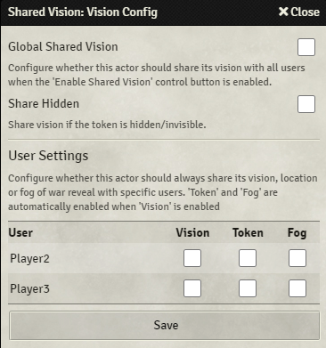

{align=right width=33%}
Using the 'Vision Config', you can configure vision sharing on a user-by-user and actor-by-actor basis.

You can find the 'Vision Config' by selecting the 'Actors Directory' in the sidebar, right-clicking the actor you want to configure, and clicking 'Shared Vision'. The 'Vision Config' screen will now open. 

The 'Global Shared Vision' checkbox determines if this actor should share its vision if the 'Global Shared Vision' control button is enabled.

Ticking the 'Share Hidden' checkbox will result in the actor sharing its vision even if the actor's tokens are hidden/invisible. 
You could, for example, add invisible tokens to a spot where you want everyone to be able to see.

In the table at the bottom you can see a row for each user where you can configure which [sharing options](sharingOptions.md) are applied for that user. 
These settings are enabled regardless of whether 'Global Shared Vision' is enabled.

Players do not need to have any permissions in order for the tokens to share their view, token location or fog exploration. This will also work if the token is an NPC.

